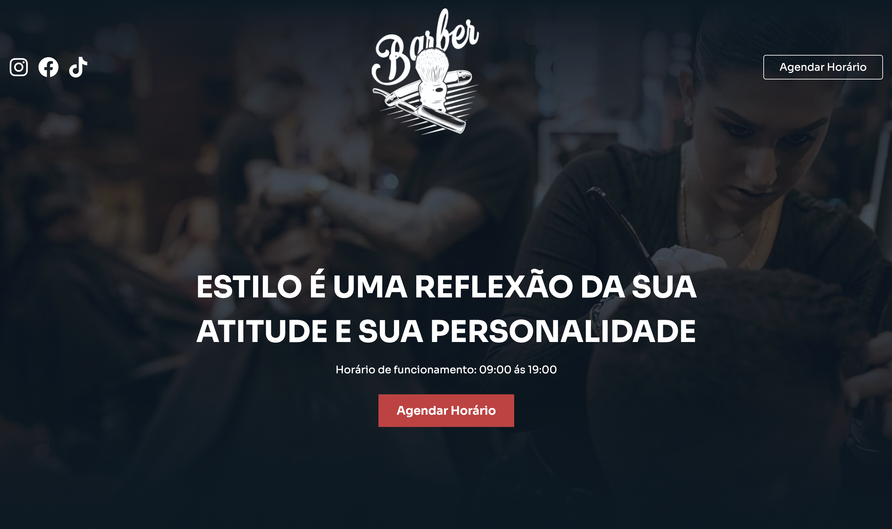

# Dom Cortês BarberShop

Dom Cortês BarberShop is my first project as a web developer for a real client.

> The goal was to build a solid and functional foundation, with the intention of continuously improving it — adding new skills, refining the design, and modernizing the site as I grow as a developer.

🔗 [View online](https://barbearia-theta-three.vercel.app/)

## 🛠️ Technologies
- HTML5
- CSS3
- SCSS
- BEM Methodology
- JavaScript

## 📌 Status
✅ Completed

🚀 Open to future improvements as I gain more experience.

## 📄 License
This project is licensed under the MIT License.
